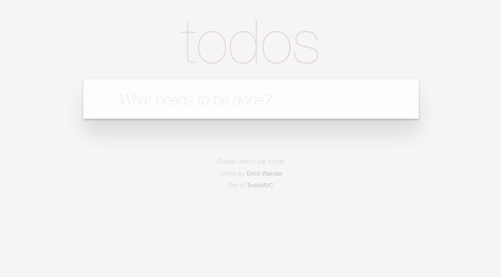

# Vue.js TodoMVC Example

- Change at [src/env.js](src/env.js) with your API_URL
- Run `npm install` and `npm run build`
- Running localy `npm run start:dev`

## Credit

This TodoMVC application was adapted based on [Vue.js Examples](https://github.com/vuejs/vue/tree/dev/examples/todomvc)

## Author

- [Erick Wendel](https://twitter.com/erickwendel_)

Thanks!